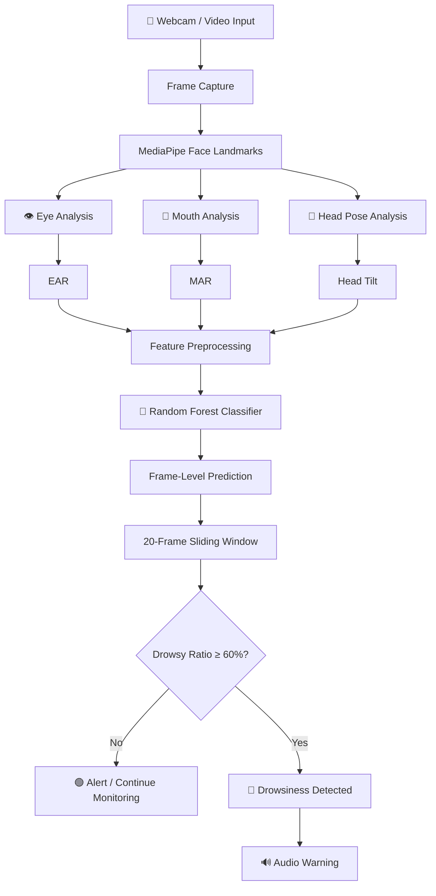

# 🚗 Driver Drowsiness Detection System

### Real-Time Driver Drowsiness Detection using Computer Vision & Machine Learning

<p align="center">


</p>

<p align="center">
  <b>An intelligent real-time system that monitors driver facial behavior and detects potential drowsiness before it becomes a safety risk.</b>
</p>

---

## 📌 Overview

**DriverGuard AI** is a real-time driver drowsiness detection system built using **Computer Vision and Machine Learning**.

The system analyzes facial behavior from a webcam or video stream and extracts three important features:

* 👁️ **Eye Aspect Ratio (EAR)**
* 👄 **Mouth Aspect Ratio (MAR)**
* 🧑 **Head Tilt**

These features are passed to a trained machine-learning classifier that predicts whether the driver is **Alert** or **Drowsy**.

Instead of relying on a single frame, the system uses a **20-frame sliding window** and triggers an alert when at least **60% of recent predictions indicate drowsiness**. This temporal approach helps avoid unnecessary alerts caused by isolated incorrect predictions.

---

## 🎯 Why Driver Drowsiness Alert System?

Driver fatigue can reduce reaction time, concentration, and decision-making ability.

A driver may show several observable signs before becoming dangerously drowsy:

```text
        Eye Closure
             │
             ▼
        ┌─────────┐
        │   EAR   │
        └────┬────┘
             │
             ▼
     Reduced Alertness
             │
      ┌──────┴──────┐
      ▼             ▼
   Yawning      Head Movement
      │             │
      ▼             ▼
     MAR        Head Tilt
      │             │
      └──────┬──────┘
             ▼
      ML Classification
             │
      ┌──────┴──────┐
      ▼             ▼
    ALERT         DROWSY
                    │
                    ▼
              🔊 WARNING
```

---

# ✨ Key Features

| Feature                | Description                                  |
| ---------------------- | -------------------------------------------- |
| 🎥 Real-Time Detection | Works with a live webcam                     |
| 📹 Video Support       | Can process pre-recorded videos              |
| 👁️ EAR Analysis       | Monitors eye-related behavior                |
| 👄 MAR Analysis        | Captures mouth-opening behavior              |
| 🧑 Head Tilt           | Tracks head orientation                      |
| 🤖 ML Classification   | Uses trained machine-learning models         |
| 🔄 Temporal Smoothing  | Uses a 20-frame prediction window            |
| 🔊 Audio Alert         | Warns the driver when drowsiness is detected |
| 📊 Model Evaluation    | Accuracy, ROC-AUC and classification metrics |
| 🧪 Cross Validation    | 5-fold stratified cross-validation           |

The implementation supports webcam, video-file, and alert-disabled execution modes.

---

# 🧠 Machine Learning Pipeline

The project uses three input features:

```text
EAR
MAR
Head Tilt
```

with:

```text
Label
  0 → Alert
  1 → Drowsy
```

The training script validates these required columns before training.

### Models Evaluated

Three machine-learning algorithms are evaluated:

1. 🌲 Random Forest
2. 📈 Gradient Boosting
3. ⚡ SVM with RBF kernel

The implementation performs **5-fold Stratified Cross-Validation** before selecting the final model.

---

# 🏗️ System Architecture



---

# 🔬 Feature Engineering

## 👁️ Eye Aspect Ratio — EAR

EAR is used to represent the degree of eye opening.

A lower EAR generally indicates that the eye is more closed.

```text
Open Eye
   ↓
Higher EAR
   ↓
Normal Alertness

Closed Eye
   ↓
Lower EAR
   ↓
Possible Drowsiness
```

## 👄 Mouth Aspect Ratio — MAR

MAR captures changes in mouth opening.

Large or prolonged mouth opening can provide an indication of yawning or fatigue-related behavior.

## 🧑 Head Tilt

Head Tilt represents changes in head orientation and can provide an additional behavioral signal when combined with eye and mouth features.

---

# 🤖 Model Training

The dataset is divided into training and testing sets using an **80/20 stratified split**.

```text
                    Dataset
                       │
                       ▼
              Data Validation
                       │
                       ▼
                Missing Values
                    Removed
                       │
                       ▼
                 80 / 20 Split
                  ┌────┴────┐
                  ▼         ▼
               Training    Testing
                  │
                  ▼
          5-Fold Cross Validation
                  │
        ┌─────────┼─────────┐
        ▼         ▼         ▼
    Random     Gradient    SVM
    Forest     Boosting    RBF
        │         │         │
        └─────────┼─────────┘
                  ▼
            Best Model
                  │
                  ▼
         Random Forest Model
                  │
                  ▼
       drowsiness_model.pkl
```

The project uses a Random Forest classifier with 200 estimators and balanced class weights.

---

# 📊 Results

> **Important:** The repository contains code that calculates the performance metrics, but the supplied project material does not provide the final numerical accuracy/ROC-AUC values. Therefore, the values below are intentionally left as placeholders rather than inventing results.

### Model Comparison

| Model                | Cross-Validation Accuracy | Status     |
| -------------------- | ------------------------: | ---------- |
| 🌲 Random Forest     |          **[ADD RESULT]** | ✅ Selected |
| 📈 Gradient Boosting |          **[ADD RESULT]** | Evaluated  |
| ⚡ SVM (RBF)          |          **[ADD RESULT]** | Evaluated  |

### Final Model

| Metric        |           Result |
| ------------- | ---------------: |
| Test Accuracy | **[ADD RESULT]** |
| ROC-AUC       | **[ADD RESULT]** |
| Precision     | **[ADD RESULT]** |
| Recall        | **[ADD RESULT]** |
| F1-Score      | **[ADD RESULT]** |

The training implementation explicitly calculates test accuracy, ROC-AUC, and a classification report.

### 📈 Model Performance

Add the generated model report here:

```markdown

```

The training script generates `model_report.png` and saves the trained model as `drowsiness_model.pkl`.

---

# 🎥 Demo

## Real-Time Detection

Add a screenshot or GIF of the application running:

```markdown

```

### Suggested demo sequence

```text
🟢 Driver Alert
       ↓
Normal facial behavior
       ↓
👁️ Eyes begin closing
       ↓
📉 EAR changes
       ↓
👄 MAR / Head Tilt changes
       ↓
🤖 ML prediction
       ↓
🔴 Drowsiness detected
       ↓
🔊 Warning generated
```

---

# 📸 Screenshots

Create an `assets/` folder and add screenshots such as:

```text
assets/
├── dashboard.png
├── alert-state.png
├── drowsy-state.png
├── model-report.png
└── demo.gif
```

Then add them to this README.

### 🟢 Alert State

```markdown

```

### 🔴 Drowsiness Detected

```markdown

```

### 📊 Model Evaluation

```markdown

```

---

# 🖥️ Demo / Usage

## 1. Install Dependencies

```bash
pip install opencv-python mediapipe==0.10.9 joblib numpy pygame scipy pandas scikit-learn matplotlib seaborn
```

## 2. Train the Model

```bash
python train_drowsiness.py
```

Or specify a dataset:

```bash
python train_drowsiness.py --csv "cleaned_dataset(1).csv"
```

## 3. Run with Webcam

```bash
python drowsiness_realtime.py
```

or:

```bash
python drowsiness_realtime.py --source 0
```

## 4. Run with Video

```bash
python drowsiness_realtime.py --source video.mp4
```

## 5. Disable Audio Alerts

```bash
python drowsiness_realtime.py --no-alert
```

These command-line modes are implemented directly in the real-time script.

---

# 📁 Project Structure

```text
DriverGuard-AI/
│
├── 📂 assets/
│   ├── dashboard.png
│   ├── drowsy-state.png
│   ├── model-report.png
│   └── demo.gif
│
├── 📂 data/
│   ├── dataset.csv
│   └── cleaned_dataset.csv
│
├── 📓 MiniProjectPreprocessing.ipynb
├── 📓 train drowsiness.ipynb
│
├── 🐍 train_drowsiness.py
├── 🐍 drowsiness_realtime.py
│
├── 🤖 drowsiness_model.pkl
├── 📊 model_report.png
│
├── 📄 requirements.txt
├── 📄 README.md
└── 📄 LICENSE
```

---

# 🛠️ Tech Stack

### Programming


### Computer Vision

* OpenCV
* MediaPipe

### Machine Learning

* Scikit-learn
* Random Forest
* Gradient Boosting
* SVM

### Data Processing

* NumPy
* Pandas
* SciPy

### Visualization

* Matplotlib
* Seaborn

### Model Persistence

* Joblib

### Alert System

* Pygame

---

# ⚙️ Important Preprocessing Note

The training dataset is already standardized/pre-scaled. The training script therefore does **not** apply another `StandardScaler`.

The real-time pipeline must apply preprocessing consistently with the training data before making predictions. The current implementation accounts for this using the original dataset statistics.

This consistency is important because feeding differently scaled live features into a model trained on standardized data can significantly affect predictions.

---

# 🔄 Real-Time Decision Logic

The system does not immediately trigger an alert from one drowsy prediction.

Instead:

```text
                 Last 20 Predictions
                        │
        ┌───────────────┴───────────────┐
        │                               │
   Alert predictions              Drowsy predictions
        │                               │
        └───────────────┬───────────────┘
                        ▼
                 Calculate Ratio
                        │
                        ▼
                Ratio ≥ 60% ?
                  /          \
                YES           NO
                 │             │
                 ▼             ▼
           🔴 DROWSY       🟢 ALERT
                 │
                 ▼
            🔊 WARNING
```

The implementation uses a `deque` with a maximum length of 20 and an alert threshold of `0.6`.

---

# 🚀 Future Roadmap

### Version 2.0

* [ ] Improve facial landmark robustness
* [ ] Add explicit yawning detection
* [ ] Add blink-rate analysis
* [ ] Improve head-pose estimation
* [ ] Add configurable alert thresholds
* [ ] Add driver fatigue statistics

### Version 3.0

* [ ] Deep-learning-based temporal model
* [ ] Mobile deployment
* [ ] Edge-device deployment
* [ ] Cloud dashboard
* [ ] Driver fatigue history
* [ ] Vehicle-system integration

---

# ⚠️ Limitations

DriverGuard AI is currently a **research/educational prototype** and should not be treated as a certified automotive safety system.

Performance can vary depending on:

* Lighting conditions
* Camera placement
* Camera quality
* Face visibility
* Head orientation
* Sunglasses or occlusion
* Individual facial characteristics
* Dataset quality

Extensive validation under real-world driving conditions would be required before safety-critical deployment.

---

# 🔐 Privacy

The system is designed around local camera/video processing.

No cloud service is required by the core implementation.

For production deployment, privacy policies and secure handling of any recorded video or derived facial data should be considered.

---

# 📚 Learning Outcomes

This project demonstrates practical implementation of:

* Computer Vision
* Facial Landmark Detection
* Feature Engineering
* Supervised Machine Learning
* Classification
* Cross-Validation
* Model Evaluation
* Real-Time Video Processing
* Temporal Prediction Smoothing
* Audio Alert Systems
* Python-based ML deployment

---

# 👨‍💻 Author

**Deon John D'Aruja**

Computer Science / AI & ML Student

📧 **Email:** deon.daruja@gmail.com

🔗 **GitHub:** https://github.com/Dj2107

🔗 **LinkedIn:** https://www.linkedin.com/in/deon-john-d’aruja-24127a295/?isSelfProfile=false

---

# ⭐ Contributing

Contributions are welcome!

1. Fork the repository
2. Create a feature branch

```bash
git checkout -b feature/new-feature
```

3. Commit your changes

```bash
git commit -m "Add new feature"
```

4. Push the branch

```bash
git push origin feature/new-feature
```

5. Open a Pull Request

---

# 📜 License

This project is licensed under the **MIT License**.

See the `LICENSE` file for details.

---

<p align="center">

### 🚗 Drive Safe. Stay Alert. Save Lives. ❤️

**Driver Drowsiness Detection System — Intelligent Drowsiness Detection**

⭐ Star this repository if you found it useful!

</p>
